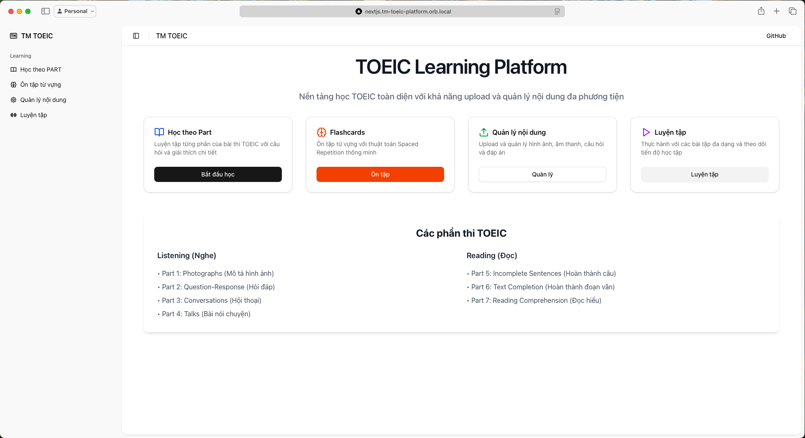
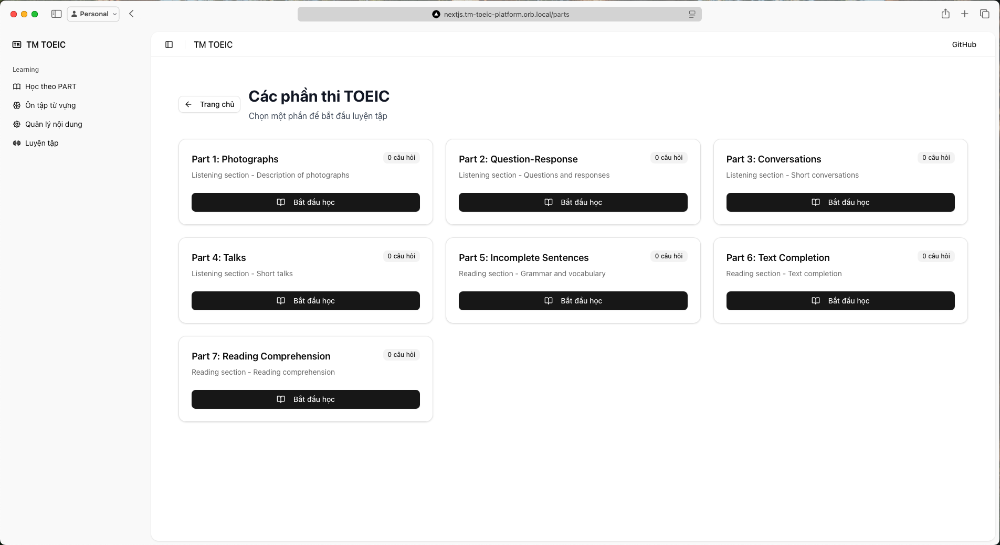
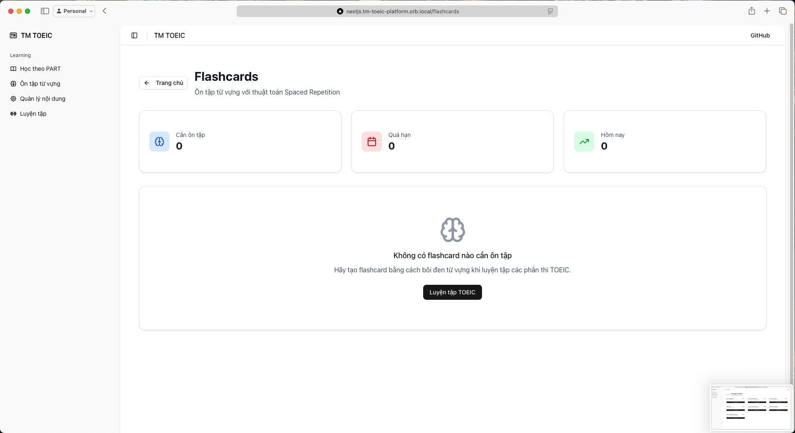
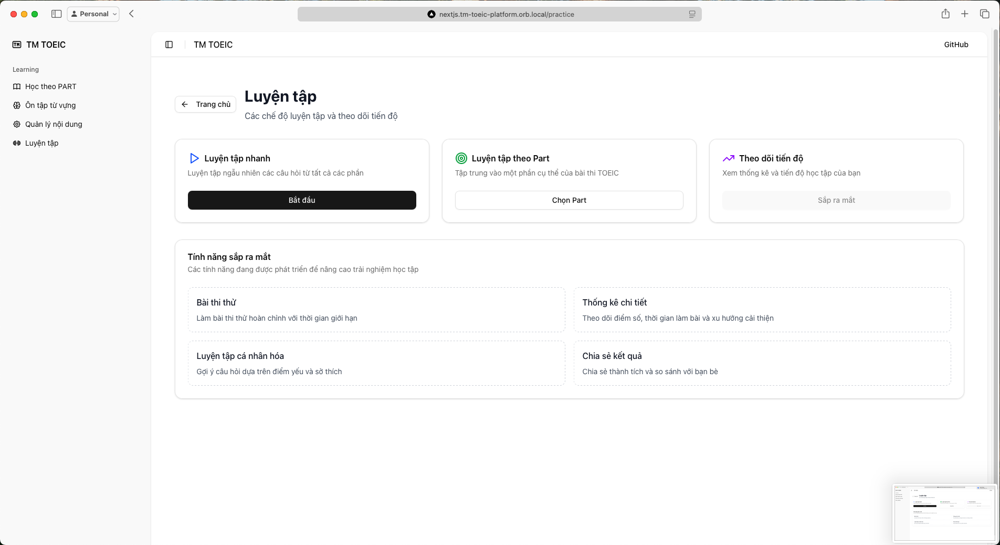

# TOEIC Learning Platform

## ✨ Tính năng chính

- 📚 **Học theo Part**: Luyện tập từng phần thi TOEIC riêng biệt
- 🧠 **Flashcards thông minh**: Hệ thống ôn tập từ vựng với thuật toán Spaced Repetition (SM-2)
- 🎵 **Audio Player nâng cao**: Phát âm thanh với đầy đủ chức năng (play/pause, volume, progress bar)
- 📝 **Quản lý nội dung**: Giao diện admin để thêm/sửa/xóa câu hỏi
- 🎨 **Giao diện hiện đại**: UI/UX đẹp mắt với Tailwind CSS và shadcn/ui
- 📱 **Responsive**: Tương thích với mọi thiết bị

## 🖼️ Giao diện

### Trang chủ

*Giao diện trang chủ với navigation và thống kê tổng quan*

### Học theo Part

*Giao diện luyện tập theo từng phần thi TOEIC với audio player nâng cao*

### Flashcards

*Hệ thống flashcards thông minh với thuật toán Spaced Repetition*

### Luyện tập

*Giao diện luyện tập tổng hợp*

## 🚀 Công nghệ sử dụng

- **Frontend**: Next.js 14 với App Router
- **UI Framework**: Tailwind CSS + shadcn/ui
- **Database**: PostgreSQL với Prisma ORM
- **File Storage**: MinIO
- **Audio**: HTML5 Audio API với custom controls
- **Deployment**: Docker với multi-platform support

## 🛠️ Cài đặt

### Yêu cầu hệ thống
- Node.js 18+
- PostgreSQL
- MinIO (hoặc S3-compatible storage)

## Hướng dẫn cài đặt và chạy

### Yêu cầu hệ thống
- Docker và Docker Compose
- Node.js 20+ (cho development)
- Git

### Cài đặt

1. **Clone repository**
```bash
git clone <repository-url>
cd toeic-learning-platform
```

2. **Cấu hình environment variables**
```bash
cp .env.example .env
# Chỉnh sửa file .env theo nhu cầu
```

3. **Khởi chạy với Docker Compose**
```bash
# Chạy tất cả services
docker-compose up -d

# Hoặc chỉ chạy database và storage
docker-compose up -d postgres minio
```

4. **Development mode (không dùng Docker)**
```bash
cd toeic-frontend
npm install
npm run dev
```

### Truy cập ứng dụng

- **Trang web chính**: http://localhost:3000
- **MinIO Console**: http://localhost:9001 (minioadmin/minioadmin123)
- **PostgreSQL**: localhost:5432 (toeic_user/toeic_password)

### Cấu trúc dự án

```
toeic-learning-platform/
├── docker-compose.yml          # Docker services configuration
├── init.sql                    # Database initialization
├── .env.example               # Environment variables template
└── toeic-frontend/            # Next.js application
    ├── src/
    │   ├── app/               # App Router pages
    │   ├── components/        # React components
    │   ├── lib/              # Utilities and configurations
    │   └── ...
    ├── prisma/               # Database schema
    ├── Dockerfile            # Container configuration
    └── package.json
```

### Tính năng chính

1. **Quản lý nội dung**
   - Upload hình ảnh và âm thanh
   - Tạo và chỉnh sửa câu hỏi
   - Quản lý đáp án và giải thích

2. **Học tập theo Part**
   - 7 phần thi TOEIC
   - Hiển thị câu hỏi với media
   - Kiểm tra đáp án và xem giải thích

3. **Lưu trữ**
   - PostgreSQL cho dữ liệu cấu trúc
   - MinIO cho file đa phương tiện

### API Endpoints

- `GET /api/parts` - Lấy danh sách các phần thi
- `GET /api/parts/[id]` - Lấy chi tiết một phần thi
- `GET /api/questions` - Lấy danh sách câu hỏi
- `POST /api/questions` - Tạo câu hỏi mới
- `POST /api/upload` - Upload file

### Troubleshooting

1. **Lỗi kết nối database**
   - Kiểm tra PostgreSQL container đang chạy
   - Xác nhận DATABASE_URL trong .env

2. **Lỗi upload file**
   - Kiểm tra MinIO container đang chạy
   - Xác nhận MINIO_* variables trong .env

3. **Port conflicts**
   - Thay đổi port mapping trong docker-compose.yml
   - Cập nhật .env tương ứng


## ✨ Tính năng Flashcard mới

### 🧠 Spaced Repetition thông minh
- Sử dụng thuật toán SM-2 để tối ưu hóa lịch trình ôn tập
- Tự động điều chỉnh khoảng thời gian ôn tập dựa trên hiệu suất học tập
- Theo dõi lịch sử ôn tập và thống kê tiến độ

### 📝 Tạo flashcard dễ dàng
- Bôi đen bất kỳ văn bản nào trong quá trình luyện tập TOEIC
- Popup tự động hiển thị để thêm vào flashcard
- Hỗ trợ thêm hình ảnh và âm thanh
- Form nhập định nghĩa và giải thích chi tiết

### 🎯 Ôn tập hiệu quả
- Giao diện flashcard trực quan với mặt trước/sau
- Hệ thống đánh giá 6 mức độ (0-5) theo chất lượng nhớ
- Thống kê chi tiết: số thẻ cần ôn, quá hạn, hôm nay
- Thanh tiến độ theo dõi quá trình ôn tập

### 🔄 Cách sử dụng Flashcard

1. **Tạo flashcard từ văn bản**:
   - Vào trang luyện tập TOEIC (Parts)
   - Bôi đen từ vựng hoặc cụm từ muốn học
   - Popup sẽ hiển thị tự động
   - Nhập định nghĩa và thêm media nếu cần
   - Nhấn "Lưu Flashcard"

2. **Ôn tập flashcard**:
   - Vào trang "Flashcards" từ menu chính
   - Xem thống kê và nhấn bắt đầu ôn tập
   - Đọc mặt trước, suy nghĩ về đáp án
   - Nhấn "Hiển thị đáp án" để xem mặt sau
   - Đánh giá mức độ nhớ từ 0-5:
     - 5: Hoàn hảo - Nhớ dễ dàng
     - 4: Tốt - Nhớ với chút do dự
     - 3: Khó - Nhớ với khó khăn
     - 2: Rất khó - Quên nhưng nhận ra khi thấy
     - 1: Quên - Hoàn toàn quên
     - 0: Không nhớ gì

3. **Theo dõi tiến độ**:
   - Xem số lượng flashcard cần ôn tập
   - Theo dõi flashcard quá hạn
   - Kiểm tra lịch trình ôn tập hàng ngày

### 🎨 Giao diện và trải nghiệm

- **Responsive design**: Hoạt động tốt trên desktop và mobile
- **Intuitive UI**: Giao diện trực quan, dễ sử dụng
- **Real-time feedback**: Phản hồi tức thì khi tương tác
- **Progress tracking**: Theo dõi tiến độ chi tiết
- **Media support**: Hỗ trợ hình ảnh và âm thanh

### 🔧 Cấu hình nâng cao

Flashcard system có thể được tùy chỉnh thông qua các environment variables:

```bash
# Số lượng flashcard tối đa mỗi session ôn tập
FLASHCARD_MAX_REVIEW_COUNT=20

# Khoảng thời gian mặc định cho flashcard mới (ngày)
FLASHCARD_DEFAULT_INTERVAL=1

# Hệ số độ dễ mặc định
FLASHCARD_DEFAULT_EASINESS=2.5
```


